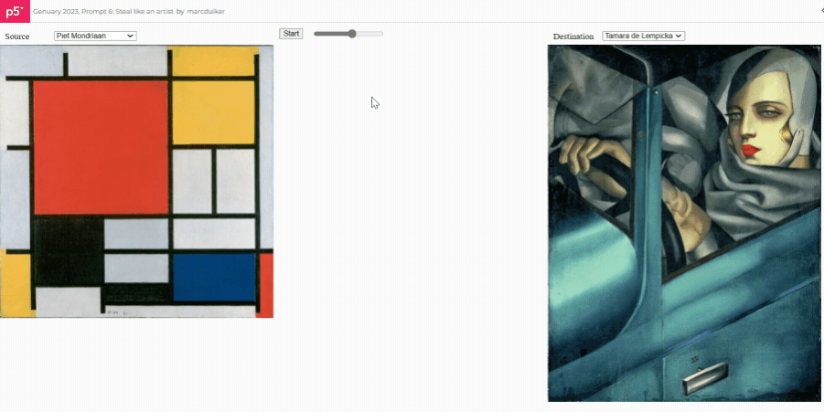

# Genuary

Repo for my contributions to [genuary.art](https://genuary.art/).

*Please don't use these for NFT based art.* 🙏

## 2024

### Prompt 1: Particles

- [Live sketch](https://openprocessing.org/sketch/2134974)
- [Code](2024/prompt01/sketch.js)

### Prompt 2: No palette

- [Live sketch](https://openprocessing.org/sketch/2135107)
- [Code](2024/prompt02/sketch.js)

## 2023

### Prompt 1: Perfect loop

- [Live sketch](https://editor.p5js.org/marcduiker/full/LL-y9TREC)
- [Code](2023/prompt01/sketch.js)

### Prompt 2: Made in 10 minutes

- [Live sketch](https://editor.p5js.org/marcduiker/full/j4Uwsq8rB) (interactive)
- [Code](2023/prompt02/sketch.js)

### Prompt 3: Glitch

- [Live sketch](https://editor.p5js.org/marcduiker/full/-VKfHUvkj) (interactive)
- [Code](2023/prompt03/sketch.js)

### Prompt 4: Intersections

- [Live sketch](https://editor.p5js.org/marcduiker/full/alDGhiITz)
- [Code](2023/prompt04/sketch.js)

### Prompt 5: Debug view

- [Live sketch](https://editor.p5js.org/marcduiker/sketches/tNVGpKDiy) (Watch the console output)
- [Code](2023/prompt05/sketch.js)

### Prompt 6: Steal like an artist

- [Live sketch](https://editor.p5js.org/marcduiker/full/ThQlj8FfO) (interactive)
- [Code](2023/prompt06/sketch.js)

### Prompt 7: Sample a color palette from your favorite movie/album cover

- [Live sketch](https://editor.p5js.org/marcduiker/full/0KakeMws0) (interactive)
- [Code](2023/prompt07/sketch.js)
